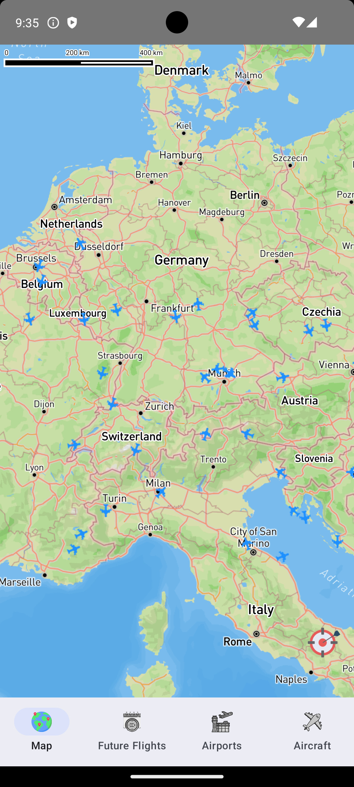
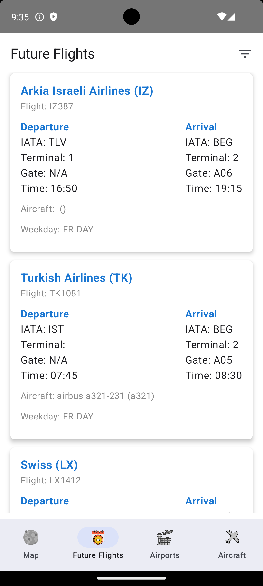
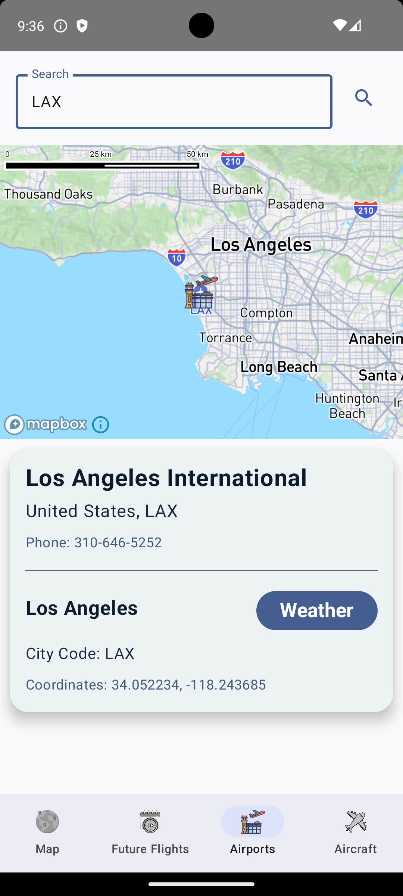
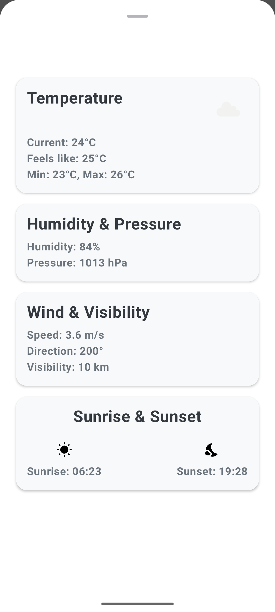
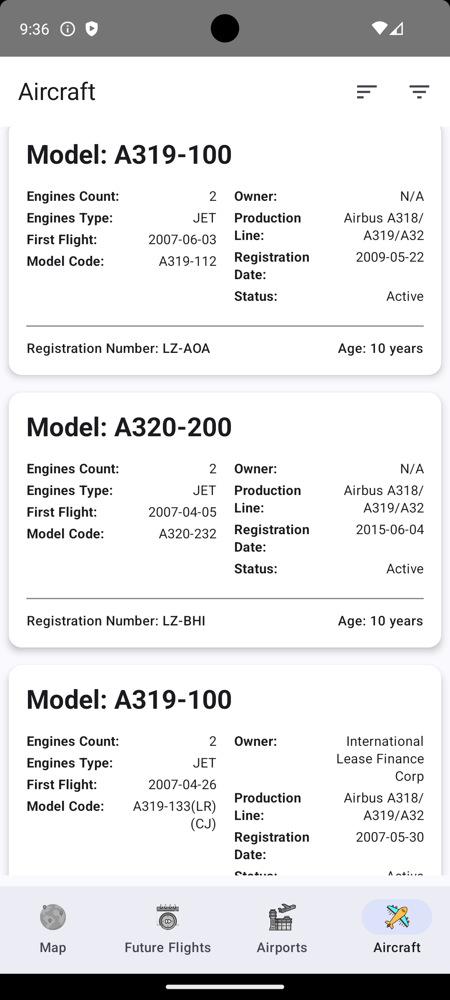

# Sky Trace

**Sky Trace** is an Android application built using **Kotlin** that allows users to track information about aircraft, including flight details, weather information, and more. The app integrates multiple APIs to gather and display data to the user.

## Screenshots

Here are some screenshots of the application:









## Technologies Used

- **Kotlin**: The primary programming language for developing the app.
- **Mapbox SDK**: Used for displaying maps and flight data.
- **Aviation Edge API**: Provides access to flight, aircraft, and airport information.
- **OpenWeatherAPI**: Used to display weather data.

## Acknowledgements

Special thanks to [Aviation Edge](https://aviation-edge.com) for providing free access to their API, which made this project possible.

## Project Setup

Before running the project, you need to create a `gradle.properties` file in your project and add the following:

```properties
org.gradle.jvmargs=-Xmx2048m -Dfile.encoding=UTF-8
android.useAndroidX=true
kotlin.code.style=official
android.nonTransitiveRClass=true

MAPBOX_DOWNLOADS_TOKEN=TOKEN_KEY
AVIATION_EDGE_API_KEY=API_KEY
OPEN_WEATHER_MAP_API_KEY=API_KEY
```

Replace `API_KEY` and `TOKEN_KEY` with your actual API keys for Mapbox, Aviation Edge, and OpenWeatherMap.

### Mapbox Setup

You also need to create a file named `mapbox_access_token.xml` in the `res/values/` directory and add your Mapbox public access token:

```xml
<?xml version="1.0" encoding="utf-8"?>
<resources xmlns:tools="http://schemas.android.com/tools">
    <string name="mapbox_access_token" translatable="false" tools:ignore="UnusedResources">Your_Mapbox_Public_Access_Token</string>
</resources>
```

Replace `Your_Mapbox_Public_Access_Token` with your actual Mapbox public access token.

This token is required for the Mapbox SDK to access the map services in the application.

## How to Run the Project

1. Clone this repository:
   ```sh
   git clone https://github.com/Plavsic01/SkyTrace.git
   ```
2. Navigate to the project directory:
   ```sh
   cd SkyTrace
   ```
3. Create the `gradle.properties` file as described above.
4. Open the project in Android Studio and run it on an emulator or a physical device.
